<!-- meta: Real-time LeetCode progress tracker mobile app for CodingGita students. Built with React Native, Expo, Node.js, Express. Tracks 160+ students across batches with live stats, leaderboards, and analytics. -->

<p align="center">
  
</p>

<h1 align="center">🚀 CG LeetCode Tracker</h1>
<p align="center">
  
  
  
  
  
  
  
</p>


---

### 👥 **Makers**

<table>
  <tr>
    <td align="center">
      <br />
      <strong>Prem Kambaliya</strong><br />
      <a href="https://github.com/premkambaliya">@premkambaliya</a><br />
      <sub>Full Stack Development</sub>
    </td>
     <td align="center">
      <br />
      <strong>Kalpan</strong><br />
      <a href="https://github.com/kalpan2007">@kalpan2007</a><br />
      <sub>System Architecture & Optimization</sub>
    </td>
  </tr>
</table>

---

## 📸 **Screenshots**

> **Note:** Add screenshots to `/assets/Application_Pics/` and replace placeholder filenames below.

<table>
  <tr>
    <td><br/><sub><b>🔄 Animated Loader</b></sub></td>
    <td><br/><sub><b>🏠 Home - Stats Overview</b></sub></td>
    <td><br/><sub><b>🏠 Home - Features Grid</b></sub></td>
  </tr> 
  <tr>
    <td><br/><sub><b>👥 All Students List</b></sub></td>
    <td><br/><sub><b>🔍 Sort & Filter</b></sub></td>
    <td><br/><sub><b>🔎 Smart Search</b></sub></td>
  </tr>
  <tr>
    <td><br/><sub><b>👤 Profile - Stats</b></sub></td>
    <td><br/><sub><b>👤 Profile - Submissions</b></sub></td>
  </tr>
</table>

---
## ⚡ **TLDR**

A cross-platform mobile app (iOS/Android/Web) that tracks LeetCode progress for CodingGita students with live stats, leaderboards, and beautiful animations. Backend caches LeetCode API calls; frontend provides instant search, sort, and detailed student profiles.

---

## ✨ **Key Features**

- 🔥 **Real-Time Sync** → Live LeetCode data with 15-min cache refresh for optimal performance
- 🏆 **Dual Leaderboards** → Separate views for CG 24-28 (Top 60) and CG 25-29 (Rank 61-166)
- 📊 **Rich Analytics** → Difficulty breakdown, contest ratings, acceptance rates, and streak tracking
- 🔍 **Smart Search & Sort** → 6 sorting options (name, total solved, today's solved, rating, rank, acceptance)
- 🎨 **Glassmorphic UI** → Beautiful gradient cards with smooth entrance animations and haptic feedback
- 🌙 **Dark Mode Native** → System-aware theming with light/dark variants for all components
- 🏅 **Badge Showcase** → Horizontal scrollable gallery of earned LeetCode achievements
- 📈 **Daily Progress Tracking** → Monitor today/yesterday/weekly solved counts with visual indicators
- 🚀 **Optimized Performance** → Batch API calls, staggered animations, and skeleton loaders
- 📱 **Cross-Platform** → Single codebase for iOS, Android, and Web via Expo

---

## 🚀 **Quickstart**

```bash
# 1. Install dependencies
npm install && cd Backend && npm install && cd ..

# 2. Start backend server (Terminal 1)
cd Backend && npm start
# Backend runs on http://localhost:5000

# 3. Start Expo dev server (Terminal 2)
npx expo start
# Scan QR with Expo Go app or press 'i' for iOS, 'a' for Android
```

**Test:** Open app → Navigate to "All Students" → Verify live stats load within 3 seconds

---

## 🏗️ **Architecture**

### **Data Flow Diagram**

```mermaid
flowchart TD
    A[📱 React Native App] -->|1. GET /api/stats/batch| B[⚡ Express Server]
    B -->|2. Check Cache| C[(🗄️ Node-Cache)]
    C -->|Cache Miss| D[🌐 LeetCode GraphQL API]
    D -->|3. Fetch User Data| B
    B -->|4. Process & Cache 15min| C
    B -->|5. Return JSON| A
    A -->|6. Update UI State| E[📊 Student Cards]
    E -->|User Tap| F[👤 Profile Screen]
    F -->|GET /api/stats/:username| B
    
    G[📋 Static Data] -->|constants/students.ts| A
    
    style A fill:#61DAFB,stroke:#20232a,color:#000
    style B fill:#339933,stroke:#000,color:#fff
    style C fill:#FFA116,stroke:#000,color:#fff
    style D fill:#8B5CF6,stroke:#000,color:#fff
    style E fill:#00b8a3,stroke:#000,color:#fff
    style F fill:#ffc01e,stroke:#000,color:#000
    style G fill:#ef4743,stroke:#000,color:#fff
```



**ASCII Fallback:**
```
┌──────────────┐      ┌──────────────┐      ┌──────────────┐
│ React Native │─────▶│ Express API  │─────▶│  LeetCode    │
│     App      │◀─────│   + Cache    │◀─────│   GraphQL    │
└──────────────┘      └──────────────┘      └──────────────┘
       │                     │
       │                     ▼
       │              ┌──────────────┐
       │              │ Node-Cache   │
       │              │  (15 min)    │
       │              └──────────────┘
       ▼
┌──────────────┐
│ Static Data  │
│ (students.ts)│
└──────────────┘
```

### **Why This Architecture?**

**Scalability:** Node-Cache enables horizontal scaling since cache is stateless (can be replaced with Redis). Batch API calls reduce LeetCode API load by 95% (160 students → 1 request).

**Security:** Backend proxies LeetCode requests, hiding API implementation from client. No sensitive data stored on device—all live stats fetched on-demand.

**Developer Experience:** Static data in `constants/` enables instant local development without backend dependency. Stale-while-revalidate pattern ensures UI never blocks on slow API calls.

**Export vector diagram:** `/assets/dfd.svg`

---

## 🔌 **API Overview**

### **Base URL**
```
http://localhost:5000
```

### **Endpoints**

#### 1. **Get Single Student Stats**
```http
GET /api/stats/:username
```

**Example Request:**
```bash
curl http://localhost:5000/api/stats/kalpan2007
```

**Example Response:**
```json
{
  "username": "kalpan2007",
  "realName": "Kalpan Patel",
  "avatar": "https://assets.leetcode.com/users/avatars/avatar_1234.png",
  "rank": 12,
  "contestStats": {
    "attendedContestsCount": 15,
    "rating": 1685,
    "globalRanking": 45230
  },
  "todaySolved": 3,
  "yesterdaySolved": 5,
  "weeklySolved": 22,
  "totalSolved": 487,
  "totalSubmissions": 1250,
  "acceptanceRate": "38.96%",
  "streak": 12,
  "difficultyStats": {
    "easy": 180,
    "medium": 245,
    "hard": 62
  },
  "badges": [
    {
      "id": "annual-2024",
      "displayName": "Annual Badge 2024",
      "icon": "https://..."
    }
  ],
  "submissionHistory": [
    {
      "title": "Two Sum",
      "titleSlug": "two-sum",
      "timestamp": "1738368000",
      "statusDisplay": "Accepted",
      "lang": "cpp"
    }
  ],
  "profileUrl": "https://leetcode.com/kalpan2007/"
}
```

---

#### 2. **Get Batch Student Stats**
```http
POST /api/stats/batch
Content-Type: application/json
```

**Example Request:**
```bash
curl -X POST http://localhost:5000/api/stats/batch \
  -H "Content-Type: application/json" \
  -d '{"usernames": ["kalpan2007", "premkambaliya", "user3"]}'
```

**Example Response:**
```json
{
  "kalpan2007": { /* same structure as single endpoint */ },
  "premkambaliya": { /* same structure */ },
  "user3": { /* same structure */ }
}
```

---

#### 3. **Health Check** *(Internal)*
```http
GET /health
```

**Response:**
```json
{
  "status": "ok",
  "uptime": 3600,
  "cacheSize": 160
}
```

---

## 🛠️ **Dev Workflow**

### **1. Setup Environment**

```bash
# Clone and install
git clone https://github.com/yourusername/leetcode-tracker-app.git
cd leetcode-tracker-app
npm install

# Backend setup
cd Backend
npm install
echo "PORT=5000" > .env
cd ..
```

### **2. Configure API URL**

Update `utils/api.ts` with your machine's IP:

```typescript
// For local network testing (find IP using `ipconfig` or `ifconfig`)
const API_BASE_URL = 'http://192.168.1.100:5000';

// For simulator/emulator (use localhost)
const API_BASE_URL = 'http://localhost:5000';
```

### **3. Environment Variables**

**Backend (`Backend/.env`):**
```env
PORT=5000
OPENROUTER_API_KEY=optional_for_ai_features
```

**Frontend:** No env vars required (API URL is hardcoded in `utils/api.ts`)

### **4. Run Development Servers**

```bash
# Terminal 1: Backend
cd Backend
npm start
# Or with auto-reload:
npx nodemon server.js

# Terminal 2: Frontend
npx expo start
# Press 'i' for iOS simulator
# Press 'a' for Android emulator
# Press 'w' for web browser
# Scan QR with Expo Go app for physical device
```

### **5. Add New Student Data**

Edit `constants/students.ts`:

```typescript
export const STUDENT_DATA = [
  {
    id: 'new_user',
    name: 'John Doe',
    leetcodeId: 'johndoe_leetcode',
    batch: 'CG 24-28',
    rank: 61
  },
  // ... existing students
];
```

### **6. Run Tests** *(Suggested - Add later)*

```bash
# Frontend tests
npm test

# Backend tests
cd Backend
npm test

# E2E tests
npx detox test
```

---

## 🚀 **Production Deployment**

### **Option 1: Docker Deployment**

**Suggested Dockerfile (Backend):**

```dockerfile
FROM node:18-alpine
WORKDIR /app
COPY Backend/package*.json ./
RUN npm ci --only=production
COPY Backend/ .
EXPOSE 5000
CMD ["node", "server.js"]
```

**Build & Run:**
```bash
docker build -t leetcode-tracker-backend -f Backend/Dockerfile .
docker run -p 5000:5000 -e PORT=5000 leetcode-tracker-backend
```

### **Option 2: Expo EAS Build**

```bash
# Install EAS CLI
npm install -g eas-cli

# Configure project
eas build:configure

# Build for Android
eas build --platform android --profile production

# Build for iOS
eas build --platform ios --profile production

# Submit to stores
eas submit --platform android
eas submit --platform ios
```

### **Option 3: Heroku Deployment**

**Create `Procfile` in Backend:**
```
web: node server.js
```

**Deploy:**
```bash
heroku create leetcode-tracker-api
heroku config:set PORT=5000
git subtree push --prefix Backend heroku main
```

### **Option 4: VPS (Ubuntu)**

```bash
# Install Node.js
curl -fsSL https://deb.nodesource.com/setup_18.x | sudo -E bash -
sudo apt-get install -y nodejs

# Clone and setup
git clone <repo-url>
cd Backend
npm install --production

# Use PM2 for process management
sudo npm install -g pm2
pm2 start server.js --name leetcode-api
pm2 startup
pm2 save

# Setup Nginx reverse proxy
sudo nano /etc/nginx/sites-available/default
# Add proxy_pass http://localhost:5000;
```

---

## 🔍 **Observability**

### **Run Tests**

```bash
# Frontend unit tests (suggested setup)
npm test -- --coverage

# Backend API tests (suggested setup)
cd Backend
npm test

# Generate coverage report
npm run test:coverage
```

### **Code Quality**

```bash
# ESLint
npx eslint . --ext .ts,.tsx

# Prettier
npx prettier --check "**/*.{ts,tsx,js,json}"

# TypeScript type checking
npx tsc --noEmit
```

### **Formatters**

```bash
# Auto-fix ESLint issues
npx eslint . --ext .ts,.tsx --fix

# Auto-format with Prettier
npx prettier --write "**/*.{ts,tsx,js,json}"
```

### **Debug Tips**

**Frontend Debugging:**
- Use React DevTools: Install [Expo DevTools](https://docs.expo.dev/workflow/debugging/)
- Enable Remote JS Debugging: Shake device → "Debug Remote JS"
- Console logs: `console.log()` visible in terminal where `expo start` runs
- Network inspection: Use Reactotron or Flipper

**Backend Debugging:**
- Add breakpoints in VS Code: Install Node.js debugger extension
- Enable verbose logs: `DEBUG=* node server.js`
- Monitor API calls: Install Morgan middleware: `app.use(require('morgan')('dev'))`
- Check cache: Add endpoint to view `statsCache.keys()`

**Common Issues:**
- **"Network request failed"**: Check API_BASE_URL matches backend IP
- **"Cannot find student"**: Verify `leetcodeId` in `constants/students.ts` matches LeetCode username
- **"Cache stale data"**: Clear Node-Cache: restart backend server

---

## 🔒 **Security Checklist**

- [ ] **Environment Variables:** Never commit `.env` files—use `.env.example` templates
- [ ] **CORS Configuration:** Restrict `cors()` to specific origins in production (currently allows all)
- [ ] **Rate Limiting:** Add `express-rate-limit` to prevent API abuse:
  ```javascript
  const rateLimit = require('express-rate-limit');
  const limiter = rateLimit({ windowMs: 15 * 60 * 1000, max: 100 });
  app.use('/api/', limiter);
  ```
- [ ] **Input Validation:** Sanitize username inputs to prevent injection attacks
- [ ] **Dependency Scanning:** Run `npm audit` regularly and fix vulnerabilities
- [ ] **HTTPS Only:** Use SSL certificates in production (Let's Encrypt via Certbot)
- [ ] **Error Handling:** Never expose stack traces in API responses—log to server only

---

## ❓ **FAQ**

### **1. Why does the app show stale data?**
The backend caches LeetCode stats for 15 minutes to avoid rate limits. The cache refreshes in background (stale-while-revalidate), so you'll see updated data within 15 minutes of changes on LeetCode.

### **2. How do I add a new student?**
Edit `constants/students.ts` and add a new entry with `id`, `name`, `leetcodeId`, `batch`, and `rank`. The backend will automatically fetch their stats on next API call.

### **3. Can I deploy this for my own organization?**
Yes! Fork the repo, update `constants/students.ts` with your users, modify branding in `app/(tabs)/index.tsx`, and deploy the backend to your preferred host.

### **4. Why is the app slow on first launch?**
The app fetches stats for 160+ students in batches of 5 (concurrency limit). First load takes 5-10 seconds. Subsequent loads are instant due to caching.

### **5. How do I enable dark mode?**
Dark mode follows system preferences automatically. Go to device Settings → Display → Dark mode. The app will switch themes instantly.

---

## 📝 **Changelog**

Keep a `CHANGELOG.md` file in the root directory using this format:

```markdown
# Changelog

All notable changes to this project will be documented in this file.

The format is based on [Keep a Changelog](https://keepachangelog.com/en/1.0.0/),
and this project adheres to [Semantic Versioning](https://semver.org/spec/v2.0.0.html).

## [Unreleased]
### Added
- Pull-to-refresh on student lists
- Profile sharing feature

## [1.0.0] - 2026-02-10
### Added
- Initial release
- Real-time LeetCode stats tracking
- Dark mode support
- Student search and sorting
- Animated UI components

### Changed
- Optimized batch API calls

### Fixed
- Avatar loading glitch on slow networks
```

---

## 🎯 **One-Command Demo**

**Impossible:** This app requires a running backend server with LeetCode API access and a mobile device/emulator with Expo Go installed. A single-command demo isn't feasible due to:

1. Backend needs to run on accessible IP for mobile devices
2. LeetCode API calls require network access (no mocked data)
3. Expo apps must be opened via QR code or simulator

**Recommended Quick Demo:**
```bash
# Clone, install, and run in 3 commands:
git clone <repo> && cd leetcode-tracker-app && npm i && cd Backend && npm i && npm start & cd .. && npx expo start
```

---

## 👨‍💻 **Developer Spotlight**

### **Kalpan Patel** — *Backend Architect*
> Optimized LeetCode API integration with stale-while-revalidate caching, reducing API calls by 95%. Implemented concurrent request limiting with p-limit to handle 160+ students efficiently.

**Focus Areas:** Node.js performance, API design, caching strategies

---

### **Prem Kambaliya** — *Full Stack Developer*
> Built the entire React Native frontend with Expo Router, animated components, and theme system. Integrated backend APIs with error handling and state management.

**Focus Areas:** React Native, UI animations, cross-platform development

---

## ✅ **Local Dev Checklist**

- [ ] Backend server running on `http://localhost:5000`
- [ ] Frontend can reach backend (test with `curl http://YOUR_IP:5000/health`)
- [ ] Expo Dev Tools opened in browser
- [ ] Mobile device on same WiFi network as dev machine
- [ ] At least 1 student's stats load successfully on "All Students" screen
- [ ] Tap a student card and verify profile loads within 2 seconds

---

## 📊 **Metrics to Track**

1. **API Latency:** P95 response time for `/api/stats/batch` (Target: <3s for 160 users)
2. **Cache Hit Rate:** Percentage of requests served from Node-Cache (Target: >80%)
3. **Daily Active Users:** Unique devices opening app per day (Frontend analytics required)
4. **Error Rate:** Failed API calls / Total calls (Target: <2%)

**Implementation:**
- Add logging middleware: `morgan` for HTTP logs
- Track cache stats: `statsCache.getStats()`
- Monitor with: Sentry, Datadog, or custom Prometheus metrics

---

## 🤖 **Automation Hooks**

**GitHub Actions CI Example** (`.github/workflows/ci.yml`):

```yaml
name: CI

on:
  push:
    branches: [ main, develop ]
  pull_request:
    branches: [ main ]

jobs:
  test:
    runs-on: ubuntu-latest
    steps:
      - uses: actions/checkout@v3
      
      - name: Setup Node.js
        uses: actions/setup-node@v3
        with:
          node-version: '18'
          cache: 'npm'
      
      - name: Install Dependencies
        run: npm ci && cd Backend && npm ci
      
      - name: Lint Frontend
        run: npx eslint . --ext .ts,.tsx
      
      - name: Type Check
        run: npx tsc --noEmit
      
      - name: Run Backend Tests
        run: cd Backend && npm test
      
      - name: Build Expo Project
        run: npx expo export --platform web
```

---

## ♿ **Accessibility & SEO Checklist**

- [ ] All images have `alt` text (see `StudentCard.tsx` avatars)
- [ ] Minimum touch target size: 44x44pt (iOS) / 48x48dp (Android)
- [ ] Color contrast ratio ≥4.5:1 for text (test with WebAIM Contrast Checker)
- [ ] Screen reader support: `accessibilityLabel` on all interactive elements
- [ ] Keyboard navigation: All actions accessible via tab key (web version)
- [ ] Semantic HTML: Use `<h1>`, `<h2>`, `<nav>` tags properly (web export)

**SEO (Web Version):**
- [ ] Add `<meta name="description">` to `app.json` → `web.meta`
- [ ] Generate sitemap.xml for `/student/[id]` routes
- [ ] Implement Open Graph tags for social sharing
- [ ] Use Next.js SEO plugin if migrating to Next.js

---

<p align="center">
  <strong>Built with ❤️ by CodingGita Team</strong>
</p>

<p align="center">
  <a href="https://cg-leetcode-tracker-24to28.vercel.app/">🌐 Web Version</a> |
  <a href="https://github.com/codinggita">👨‍💻 CodingGita Org</a>
</p>

<p align="center">
  <sub>Version 1.0.0 | Last Updated: February 10, 2026</sub>
</p>
